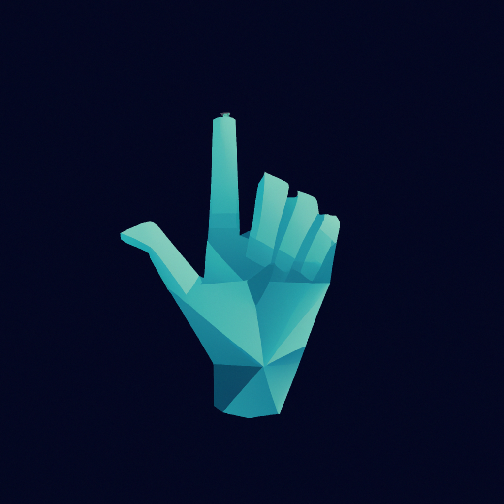

<p align="center">
  
</p>
<br> <br>

# Wangsaff-SIBI
Wangsaff SIBI is a sign language video translator experiment. This repo initially started as a fun project to fill my holiday.
Currently we are working on Indonesian Based Sign Languange (SIBI). This project is on development stage.

## How to Use ?
1. Clone the repository
```
  $ git clone https://github.com/tamtemtomm/Wangsaff-SIBI.git
```
</br>

2. Install dependencies
```
  cd .\Wangsaff-SIBI\
  pip install -r requirements.txt
```
<br/>

3. Run the program
```
  python main.py
```
<br/>

4. Customize function </br> </br>
If you want to customize the usage of program, you can change the parameter of `read_video` function in `main.py`. Currently there are two pretrained model for sign language gestures. Each were implemented using torch and keras. Here is the snippets of the `read_video` function

```
read_video(model_path:str,
           camera = 0,
           input_video=None, 
           output_video=None, 
           show=True,
           confidence_extraction=0.1,
           fps_reader = 25)
```
You can costumize the parameter according to the table below </br>

|  Parameter  |  Value  |
|  ---------- | ------- |
|  model_path |  `TORCH_MODEL_PATH` or `KERAS_MODEL_PATH`|
|  camera |  Int value if you using the program for output camera |
|  input_video |  Input video path if you using the program for existing video |
|  output_video |  Output video path for processed video, input_video should not be None |
|  confidence_extraction |  Confidence threshold for handmark extraction, value between 0-1 |
|  fps_reader |  fps for input_video reader, input_video should not be None |

## Documentation

### Gesture Detection Training Stage

|  Model  |  Notebook  |
|  ---------- | ------- |
|  SIBITorchv2 |  [](https://colab.research.google.com/drive/1yzXkvgT_XLaJKFXyoEk8weG-mdEFrFH-?usp=sharing) | 
|  SIBIKeras |   [](https://colab.research.google.com/drive/1OeRZ8_D83PloU22k80pWyQtTZqGvkl1M?usp=sharing) | 

### Word Correction Mechanism

|  Model  |  Notebook  |
|  ---------- | ------- |
|  Indonesian Spell Corrector |  [](https://colab.research.google.com/drive/1XParLEVWZnmHXFsB8u3alkMPTqnan24F?usp=sharing) | 

## Known issues (On Development!)
